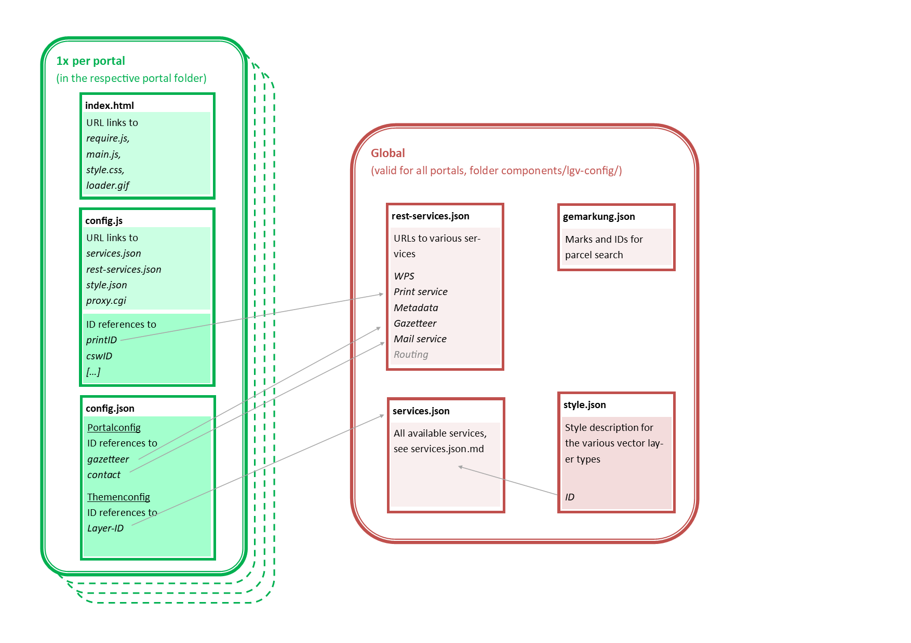

# Documentation overview

>The Masterportal requires various configuration files documented on these pages. Furthermore, available URL parameters and required proxies are described.

[TOC]

## Configuration files

The Masterportal builds on global and portal-specific configuration files alike.

### Global configuration files

These files describe central information to be used by multiple portals:

* **[services.json](services.json.md)**: lists all available WMS layers and WFS FeatureTypes
* **[rest-services.json](rest-services.json.md)**: URLs to various external services
* **[style.json](style.json.md)**: holds style definitions for WFS FeatureTypes

### Portal-specific configuration files

These files define the distinguishing features of an instance:

* **[config.js](config.js.md)**: Configuration of paths to further configuration files and services
* **[config.json](config.json.md)**: Configuration of portal appearance and available contents

The following figure schematically demonstrates the ensemble of files. Please mind that the files **index.html**, **[config.js](config.js.md)**, and **[config.json](config.json.md)** must be placed in the same path.

## URL parameters

The Masterportal can be called with **[URL parameters](urlParameter.md)** to e.g. call functions initially or describe a view.

## Proxies

For requesting attribution information via `WMS GetFeatureInfo` and for loading WFS layers, **[proxies](proxies.md)** have to be defined.
